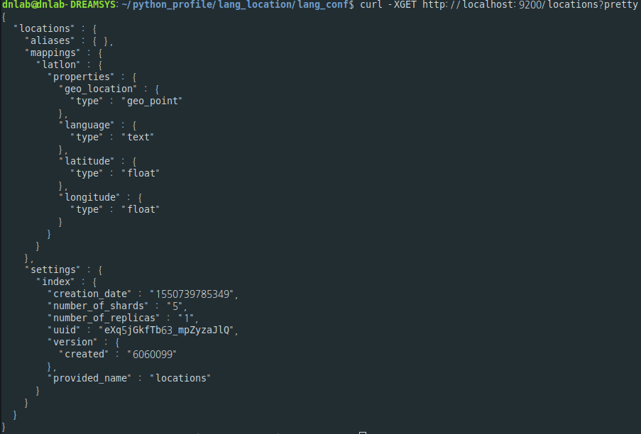
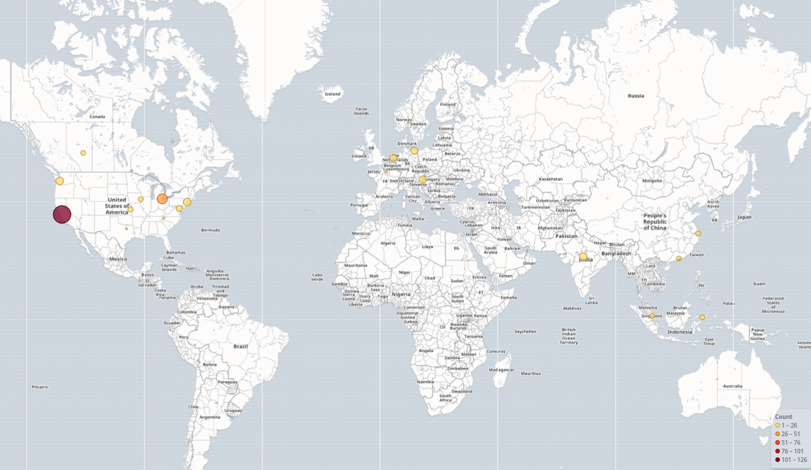

# ComputerLanguage_LocalDistributionChart

### Github에서 사용자(약 100명)가 사용하는 language의 지역 분포에 대해 알아본다.

1. 사용하는 스킬
	- Python
	- Rest API (v3)
	- GraphQL API (v4)
	- ELK 스택

2. 기본 구조  

3. 실행 순서 및 파일의 내용
	- 첫 번째로 "python3 main.py userID:userPWD language" 를 이용하여 원하는 언어에 대한 사람들의 location data를 가져온다. => 해당 결과로 LocationData_langeage.csv 파일이 생성된다. (ex: LocationData_Python.csv)
	- 두 번째로 "python3 change_df.py" 를 이용하여 lang_conf폴더에 location.json 파일이 생성된다. => 해당 파일은 최종적으로 Kibana에 data를 저장하여 chart로 표시하기 위한 형태를 만든 것이다.
	- ./lang_conf/mapping.json 은 Elastic search에서 각각의 properties의 type을 지정하기 위해서 사용했다.
	- ./lang_conf/location.json 은 Elastic search에서 index안에 Bucket으로 정보를 넣기 위해서 사용했다.

4. ELK 스택 간단한 명령어 (순서대로)
	- curl -XPUT http://localhost:9200/locations (저장공간인 index 생성)
	- curl -XPUT http://localhost:9200/locations/latlon/_mapping -H 'Content-Type:application/json' -d @mapping.json (index에 들어있는 data들의 type등을 설정)
	- curl -XPOST http://localhost:9200/_bulk?pretty -H 'Content-Type:application/json' --data-binary @location.json (bulk post로 location.json파일의 형태로 data를 삽입)
	- curl -XGET http://localhost:9200/locations?pretty (해당 정보를 가져오자)

5. Kibana -> Coordinate Map

---

## 기타사항
	- 지역의 좌표(위도, 경도)를 얻어오는 과정에서 Google Map API는 비용을 부담해야 하기에 python selenium을 사용하여 좌표를 찾았습니다.  
[좌표를 얻은 사이트](https://www.latlong.net/countries.html)

## 부족한 부분
	- 좌표를 얻는 과정에서 해당 사이트에 많은 의존을 두었기에 등록이 되어있지 않은 좌표에 대해서는 생략하였습니다.
	- Logstash를 사용할려고 하였으나, geo_point에 대한 이해 부족으로 Elastic search에서 바로 Kibana를 사용하였습니다.
